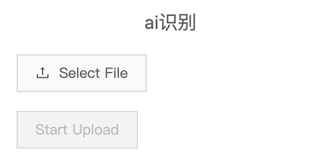

> 相关地址

本库前端详细说明请转至CSDN：[click here !!!](https://blog.csdn.net/weixin_43783814/article/details/126185922)

本库低代码部分对应后端实现：[oatpp-low-code](https://github.com/li-car-fei/oatpp-low-code)

AI识别模型以及后端简单代码：[sketch2code](https://github.com/li-car-fei/sketch2code)

示例图：


# 总体架构

- 基于umi进行架构，`/pages/index.js` 中只有一个link到初始表单页面，根据umi的页面逻辑，`/pages`下的所有jsx文件都能够通过umi路由进行指向并渲染

- 初始表单页面通过`/components`中的`form-table`与`form-dialog`组件协助，完成表单显示与修改的功能，其中表单选项的操作部分逻辑写在了`_config`文件中，将表单的初始操作对象传进去进行操作

- `edit`界面需要完成信息的传递工作，因此需要将组件数据注册在这里，组件操作所有相关函数都写在这里，以便通信之后完成数据的改写操作

- 中间的显示通过Iframe完成，而Iframe组件只负责新建iframe并完成信息的传递，实际页面显示是通过路由定向到`/visual-page/checked-comp`完成，对应的页面则依靠Drop与`/mobile_components`完成页面渲染，对应的数据操作都`window.parent.postMessage`传递到上层，上层完成对应数据的修改操作

- 而中间显示页面通过`/mobile_components`封装好的传入`data`进行渲染，右端的修改组件，根据`/mobile_components`预先写好的`schema.json`配合表单属性进行配置，表单组件根据新建的属性与配置完成渲染

## feature

1. 整体框架基于[umijs](https://umijs.org/)
2. 表单组件基于[Formily 2+ schema](https://v2.formilyjs.org/zh-CN)
3. 拖拽基于[html5 drag&drop 属性](https://developer.mozilla.org/zh-CN/docs/Web/API/HTML_Drag_and_Drop_API)
4. 移动端组件基于[antd-mobile](https://mobile.ant.design/)


### 拖拽的简单实现

通过设置拖拽相关的属性，使得元素可以被拖拽，通过`e.dataTransfer.setData()`将拖拽元素的信息传递到接收拖拽的组件事件中
ps：这里暂无信息可传
```javascript
  // 拖拽开始
  const handleDragStart = e => {
    e.dataTransfer.effectAllowed = 'copy'
    e.dataTransfer.setData('data', JSON.stringify('add new node through drag'))
    setShowDrop(true)
  }

  // 拖拽结束
  const handleDragEnd = e => {
    e.dataTransfer.clearData()
    setShowDrop(false)
  }

     <div
        draggable
        onDragStart={handleDragStart}
        onDragEnd={handleDragEnd}
    >
        <PlusSquareTwoTone />
        拖拽
    </div>
```

在拖拽的接收组件端，设置允许拖拽放下的相关属性`onDrop`，并按照逻辑将上层传入的信息处理，最后向上发送事件进行处理
```javascript
const handleDrop = e => {
    e.preventDefault()
    const dataStr = e.dataTransfer.getData('data')
    const data = JSON.parse(dataStr)
    console.log(data)               // 'add new node through drag'
    window.parent.postMessage(
        JSON.stringify({ func: 'handleDrop' }),
        '*'
    )
}

<div
    onDragOver={handleDragOver}
    onDragLeave={handleDragLeave}
    onDrop={handleDrop}
    >
    {!!(counter) && (<Graph graph={graph} options={options} events={events} style={{ height: "640px" }} />)}
</div>
```

> 基于sketch2code AI 模型的无代码实现

## 基于sketch2code AI 模型的无代码实现 

过AI输出DSL，完成转译后实现页面；



## to do
丰富组件库

## Build Setup

```bash
# install dependencies
yarn

# serve with hot reload at localhost:8080
yarn start

# build for production with minification
yarn build
```

> 与低代码编辑相似的图编辑实现
### 与低代码编辑相似的图编辑实现

